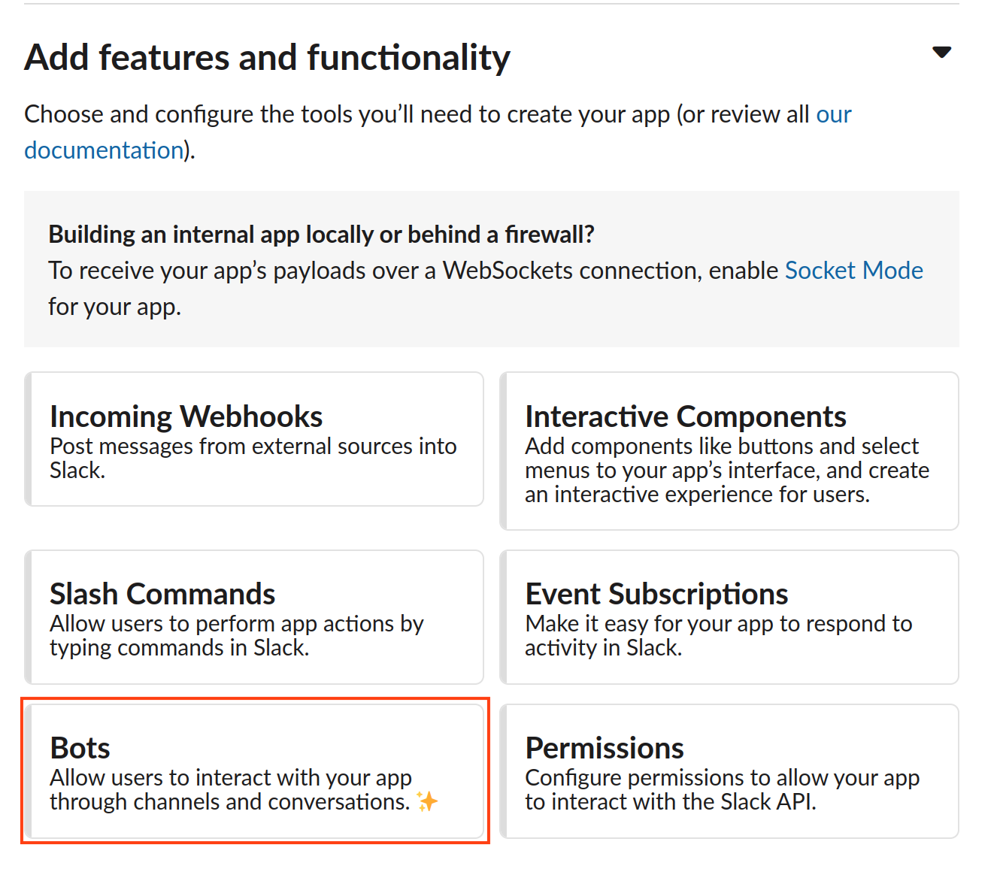

# Slack

## Introduction

Receive alerts and notifications directly to your chosen slack channel for faster response and better real-time observability.

## Guide

### Step 1: Create an app

Please [create](https://api.slack.com/apps/new) an app 'from scratch'

<figure><figcaption></figcaption></figure>

Choose a name. For example - "Memphis"

Choose a workspace.

### Step 2: Configure the slack app

Under "Add features and functionality", choose "Bots"

<figure><figcaption></figcaption></figure>

Assign scope by clicking on the "Review Scopes to Add"

<figure><figcaption></figcaption></figure>

Add the following scopes

<figure><figcaption></figcaption></figure>

Install the app (Sometimes you need to switch pages to "Install app" on the left menu)

<figure><figcaption></figcaption></figure>

### Step 3: Implement the token in Memphis

Once the slack app is installed, grab the "Bot User OAuth Token" and paste it into Memphis' slack integration model

<figure><figcaption></figcaption></figure>

For the bot token

<figure><figcaption></figcaption></figure>

For the channel ID -> left-click over the designated slack channel in your workspace -> View channel details -> Scroll down in the "About" tab -> Copy and paste the ID

<figure><figcaption></figcaption></figure>

### Step 4: Invite the new bot to the required channel

Enter the desired channel -> Click on the "+" button on the bottom-left corner -> Click on "Browse apps."

<figure><figcaption></figcaption></figure>

Search for the newly created slack app.

<figure><figcaption></figcaption></figure>
