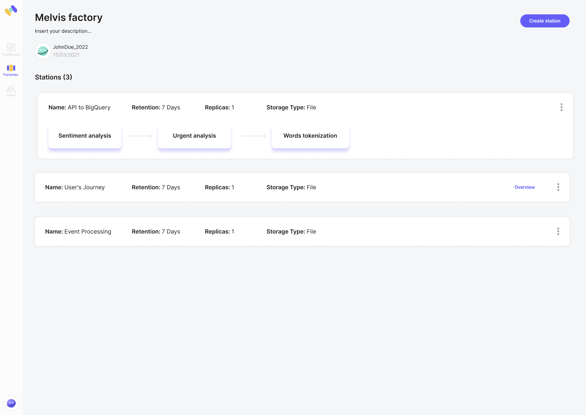

# Stations

RabbitMQ has queues, Kafka has topics, and Memphis has stations.

In its simplest form, a station provides a powerful yet easy-to-use messaging queue for apps.

Its true power lies in offloading the business logic from the producers and consumers and embedding it inside the station.

Instead of endless amounts of producers, consumers, orchestrations, manual scaling, and scattered monitoring - just create a station.

### Create a station

To create a new station, click "Create station".\
>)

A modal will appear with customization options.

.png>)

* **Retention** - The default value is seven days. You can choose a custom retention value by time, message size, and message amount.
* ****[**Storage type**](broken-reference) - Choose whether to store your messages in a file or memory.
* ****[**Replicas**](../memphis/architecture.md#replicas) - Choose how many replicas to create behind your station.

### Station overview

All the required information for a specific station is presented here.

### Code Example - How to connect an app

Press the SDK button to display the station's connection details.

* 
  * **Language** - The user can change the SDK details per their desired language (for now, Memphis supports Node.js).
  * **Installation** - Before the user can use the SDK, they must install Memphis.
  * **Code Example -** The example demonstrates how to connect Memphis and create a factory, station, consumer, and producer.

### Producers & Consumers

* In this section, Memphis provides data-level observability to see the flow of the user's events.
* The right and left panels show lists of producers and consumers.
* The center panel represents the last 50 messages that are currently stored in the station.
