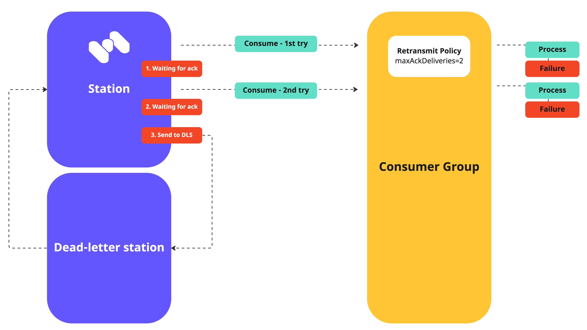
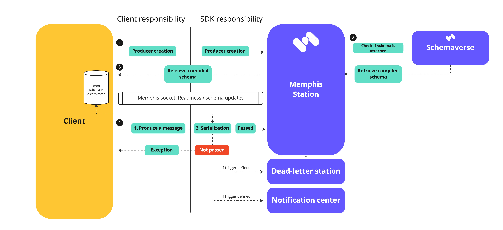
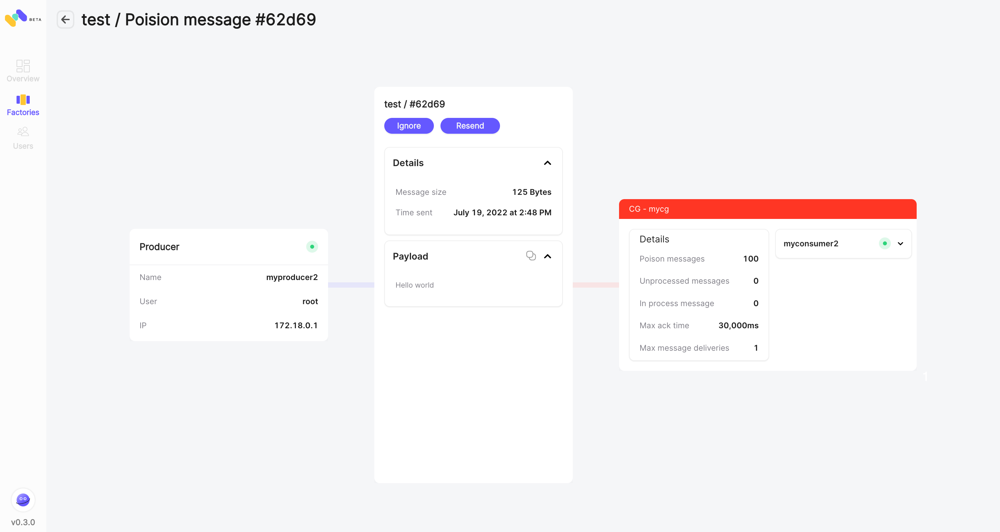

# Dead-letter Station (DLS)

## Introduction

Dead-letter station will often be named "Dead-letter queue" in other messaging systems.

Dead-letter station (=queue) is both a concept and a solution that is useful for debugging clients because it lets you isolate and "recycle" instead of drop unconsumed messages to determine why their processing doesn't succeed.

Upon creation of a Memphis station, a dead-letter station will be created by default since it does not consume any resources or storage unless there are messages.

Once the user has debugged the consumer application or the consumer application is available to consume the message, a retransmit can take place directly from the dead-letter station according in the following methods

* Move the messages back to the source station with just a click of a button on the Memphis GUI
* Retransmit the message directly to the unconsumed consumer
* Consume the message directly through the SDK from any consumer
* Drop the message from the Dead-letter station

## Terminology

**Poison messages** = Messages that cause a consumer group to repeatedly require a delivery (possibly due to a consumer failure) such that the message is never processed completely and acknowledged so that it can be stopped being sent again to the same consumer.

**Example**: Some message on an arbitrary station pulled by a consumer of a certain consumer group. That consumer, for some reason, doesn't succeed in handling it. It can be due to a bug, an unknown schema, a resource issue, etc…

## How do dead-letter stations work?

Sometimes, messages can't be processed because of various possible issues, such as erroneous conditions within the producer or consumer application, bad schema, or an unexpected state change that causes an issue with your application code. For example, if a user places a web order with a particular product ID, but the product ID is deleted, the web store's code fails and displays an error, and the message with the order request is sent to a dead-letter queue.

Occasionally, producers and consumers might fail to interpret aspects of the protocol that they use to communicate, causing message corruption or loss. Also, the consumer's hardware errors might corrupt the message payload or break the consumer itself.

A message will be flagged as "Poison" and sent to the dead-letter station **when passing the `maxAckDeliveries` value.**

`maxAckDeliveries` is the parameter that defines how many times the broker will try to redeliver the same message to the same CG until receiving an "Ack."

<figure><figcaption></figcaption></figure>

## Types of messages

The DLS will automatically (based on user decision) catch messages of the following types -

* **Unacknowledged**. Messages that passed the `maxAckDeliveries` parameter.
* **Schema violation.** Messages that did not pass the attached schema validation. As Memphis mission is to narrow data loss, and increase observability, messages that did not pass schema validation can be important and indicate some producer issues. Therefore, Memphis supports storing such messages.

<figure><figcaption>
How "Schema violation" messages reach DLS
</figcaption></figure>

### How to recover (=resend) a DLS message

Message recovery or "resend" does not require any code change or downtime to the consumers. Memphis will push the message over the same "station connection."

Every type of stored DLS message has a unique recovery strategy.

* For **"Unacknowledged"** message - The message will be resent directly to the unacknowledged consumer group/s. Traditional message brokers usually reproduce the message back to the queue, but that behavior will produce an already ACK message to all of the consumer groups, both the ones that ACK the message and those who do not and can bring duplicate processing. Memphis implemented a mechanism to resend the message only to unacknowledged consumer groups to avoid such a scenario.
* For "**Schema violation**" message - Observability only. Resend is currently not available. Future releases will enable the user to change the schema if needed and push the message back to the station as it did not consume by any CG.&#x20;

### Message Journey

After clicking on "Message Journey," the user will be redirected to this screen which is in the context of a single message.

**Left panel -** The producer of the message

**Center panel -** The message and its metadata.

**Right panel -** the unacknowledged consumer groups.
