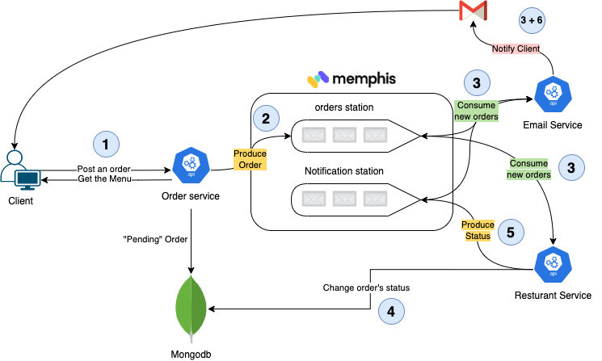

# Event-driven app

### Building a distributed, event-driven food delivery application


With Memphis, we can develop a system that requires asynchronous communication to process various tasks in the backend. More precisely, in this case, we will build a distributed message-based groceries delivery application using Node.js, Express, MongoDB, Memphis, and Kubernetes.&#x20;

We’ll also be injecting faults in the system to examine the resilience it offers.

Many thanks to [Dhanush Kamath](https://medium.com/swlh/rabbitmq-developing-message-based-applications-a56003c55649) for the use case and supporting article.


.png>)

### High-Level Plan

1. Install Minikube using brew package manager
2. Install Memphis over Minikube
3. Clone "Fastmart" [GitHub](https://github.com/yanivbh1/FastMart) repo
4. Review the code, the different services, and how they interact with each other
5. Deploy "Fastmart" over Kubernetes
6. Order food!

### Let's start!


The application that we’ll be building in this tutorial is called FastMart. [FastMart](https://github.com/yanivbh1/FastMart) is a food delivery platform that allows users to order different food and track their delivery in real-time.

### 1. Install Minikube

For the installation commands, please head here: [https://minikube.sigs.k8s.io/docs/start/](https://minikube.sigs.k8s.io/docs/start/)

minikube is local Kubernetes, focusing on making it easy to learn and develop for Kubernetes.

All you need is Docker (or similarly compatible) container or a Virtual Machine environment, and Kubernetes is a single command away: `minikube start`

**What you’ll need**

* 2 CPUs or more
* 2GB of free memory
* 20GB of free disk space
* Internet connection
* Container or virtual machine manager, such as: [Docker](https://minikube.sigs.k8s.io/docs/drivers/docker/), [Hyperkit](https://minikube.sigs.k8s.io/docs/drivers/hyperkit/), [Hyper-V](https://minikube.sigs.k8s.io/docs/drivers/hyperv/), [KVM](https://minikube.sigs.k8s.io/docs/drivers/kvm2/), [Parallels](https://minikube.sigs.k8s.io/docs/drivers/parallels/), [Podman](https://minikube.sigs.k8s.io/docs/drivers/podman/), [VirtualBox](https://minikube.sigs.k8s.io/docs/drivers/virtualbox/), or [VMware Fusion/Workstation](https://minikube.sigs.k8s.io/docs/drivers/vmware/)

Output -&#x20;


```
kubectl get ns
```

Output -

```
NAME              STATUS   AGE
default           Active   31h
kube-node-lease   Active   31h
kube-public       Active   31h
kube-system       Active   31h
```

### 2. Install Memphis

```
helm repo add memphis https://k8s.memphis.dev/charts/ &&
helm install memphis memphis/memphis --set connectionToken="memphis" --create-namespace --namespace memphis
```

Let's wait a minute or two, allowing the different components to reach "Running" state

```
kubectl get pods -n memphis
```

Output -

```
NAME                           READY   STATUS             RESTARTS      AGE
k8s-busybox-68867bb9b7-sqdql   0/1     CrashLoopBackOff   4 (68s ago)   3m13s
memphis-broker-0               3/3     Running            4 (55s ago)   3m13s
memphis-ui-fd54f5bd6-zzqd4     0/1     CrashLoopBackOff   4 (79s ago)   3m13s
mongodb-replica-0              1/1     Running            0             3m13s
```

```
NAME                           READY   STATUS             RESTARTS      AGE
k8s-busybox-68867bb9b7-sqdql   0/1     CrashLoopBackOff   4 (76s ago)   3m21s
memphis-broker-0               3/3     Running            4 (63s ago)   3m21s
memphis-ui-fd54f5bd6-zzqd4     1/1     Running            5 (87s ago)   3m21s
mongodb-replica-0              1/1     Running            0             3m21s
```


**k8s-busybox** **can be ignored**. It will be fixed in the coming versions


### 3. Clone the Fastmart repo

```
git clone https://github.com/yanivbh1/FastMart.git
```

### 4. System Architecture, Code, and Flow <a href="#e46a" id="e46a"></a>



[FastMart](https://github.com/yanivbh1/FastMart) has three main components:

<mark style="color:green;">**`order-service`**</mark> - Exposes REST endpoints that allow clients to fetch the food menu, place an order and track the order in real-time.&#x20;

A new order will be saved in mongo with the status "Pending" and will be produced (Pushed) into "orders" station

```
GET: /<orderId>
Example: curl http://order-service:3000/30

POST: /<order_details>
Example: curl -X POST http://order-service:3000/api/orders -d '{"items":[{"name":"burger","quantity":1}], "email":"yaniv@memphis.dev"}' -H 'Content-Type: application/json'
```


The code responsible for communicating with Memphis will be found on -

`./order-service/src/services/mqService.js`

```
const memphis = require("memphis-dev");
const { logger } = require('./loggerService')
const MEMPHIS_HOST = process.env.MEMPHIS_HOST || 'localhost'; // create MQ connection string using environment variable
const MEMPHIS_USERNAME = process.env.MEMPHIS_USERNAME;
const MEMPHIS_TOKEN = process.env.MEMPHIS_TOKEN;
let ordersStation_producer = null;

const memphisConnect = async () => {
    try {
        logger.info(`Memphis - trying to connect`)
        await memphis.connect({
            host: MEMPHIS_HOST,
            username: MEMPHIS_USERNAME,
            connectionToken: MEMPHIS_TOKEN
        });
        logger.info(`Memphis - connection established`)

        ordersStation_producer = await memphis.producer({
            stationName: "orders",
            producerName: "order_service",
        });
        logger.info(`ordersStation_producer created`)
    } catch(ex) {
        logger.log('fatal',`Memphis - ${ex}`);
        memphis.close();
        process.exit();
    }
}

/**
 * Publish order to station
 * @param {Object} order - order object containing order details
 */
const publishOrderToStation = (order) => {
    ordersStation_producer.produce({message: Buffer.from(JSON.stringify(order))});
    logger.info(`Memphis - order ${order._id} placed`);
}

/**
 * An express middleware for injecting queue services into the request object.
 * @param {Object} req - express request object.
 * @param {Object} res - express response object.
 * @param {Function} next - express next() function.
 */

 const injectPublishService = (req, res, next) => {
    // add all exchange operations here
    const stationServices = {
        publishOrderToStation: publishOrderToStation
    }
    // inject exchangeServices in request object
    req.stationServices = stationServices;
    next();
}

module.exports = {
    injectPublishService: injectPublishService,
    memphisConnect: memphisConnect,
}

```

<mark style="color:green;">**`email-service`**</mark> - Responsible for notifying the client of the different stages.

email-service consumer messages from two stations: `orders` and `notifications.`

As soon as an order is inserted into the station, the email service notifies the client with an order confirmation.

At the same time listens for new notification requests of other services


<mark style="color:green;">**`resturant-service`**</mark> - Responsible for fulfilling an order.

1. Consume an order
2. Process the order -&#x20;
   1. Change order status at the MongoDB level to "Accepted"
   2. Using constant sleep time to mimic the preparation of the food by the restaurant
   3. Change order status at the MongoDB level to "Delivered"
   4. Sending notification to the client


### 5. Deploy "Fastmart" over Kubernetes

Fastmart repo tree -&#x20;


To deploy Fastmart namespace and different services,

please run `kubectl apply -f k8s-deployment.yaml`

```
kubectl get pods -n fastmart
```

Output -

```
NAME                                 READY   STATUS             RESTARTS   AGE
email-service-5ddb9b58d6-bq2xd       0/1     CrashLoopBackOff   3          103s
fastmart-ui-5c9bc497bd-kn4lk         1/1     Running            0          11m
orders-service-5b689b66-4h8t9        0/1     CrashLoopBackOff   7          11m
resturant-service-6d97cf6fdc-c9mvs   0/1     Completed          4          103s
```

Let's understand why Fastmart services cant start

```
kubectl logs email-service-5ddb9b58d6-bq2xd -n fastmart                       
```

Output -

```
> email-service@1.0.0 start
> node ./index.js

17-05-2022 07:10:09 PM - info: Sleeping for 300ms before connecting to Memphis.
17-05-2022 07:10:09 PM - info: Memphis - trying to connect
17-05-2022 07:10:09 PM - info: email-service started
17-05-2022 07:10:09 PM - fatal: Memphis - User is not exist
```

It appears that the services try to connect to "Memphis" with the user "fastmart" which does not exist and we require to create it.

**The simplest way to add a new user would be through the UI**, but let's do it via CLI.

Please install Memphis CLI via [here](../../cli/installation.md).

```
 $ mem
Usage: index <command> [options]

Options:
  -V, --version  output the version number
  -h, --help     display help for command

Commands:
  connect        Connection to Memphis
  factory        Factories usage commands
  station        Stations usage commands
  user           Users usage commands
  producer       Producers usage commands
  consumer       Consumer usage commands
  init           Creates an example project for working with Memphis
  help           display help for command

Factory is the place to bind stations that have some close business logic
Factory Commands:
   ls                List of factories
   create            Create new factory
   edit              Edit factory name and/or description
   del               Delete a factory

Station is Memphis' queue/topic/channel/subject
Station Commands:
   ls                List of stations
   create            Create new station
   info              Specific station's info
   del               Delete a station

Manage users and permissions
User Commands:
   ls                List of users
   add               Add new user
   del               Delete user

Producer is the entity who can send messages into stations
Producer Commands:
   ls                List of Producers

Consumer is the entity who can consume messages from stations
Consumer Commands:
   ls                List of Consumers
```

To connect the CLI with Memphis control plane we need -&#x20;

* root password

```
kubectl get secret memphis-creds -n memphis -o jsonpath="{.data.ROOT_PASSWORD}" | base64 --decode

OqEO9AbncKFF93r9Qd5V
```

* memphis control-plane url

```
kubectl port-forward service/memphis-cluster 7766:7766 6666:6666 5555:5555 --namespace memphis > /dev/null &
```

Now, connect the CLI

```
mem connect --user root --password bpdASQlhwWNzFt4JwLQo --server localhost:5555
```


Add the user "fastmart"

```
mem user add -u fastmart --type application
```

Or via the UI


**Soon after we will create the user,**&#x20;

**the pods will restart automatically and reconnect with Memphis.**


 

### 6. Order food!

To expose the `orders-service` through localhost, run

```
kubectl port-forward service/orders 9001:80 --namespace fastmart > /dev/null &
```

Get the menu

```
curl localhost:9001/api/menu

Output -
{"items":[{"name":"burger","price":50},{"name":"fries","price":20},{"name":"coke","price":10}]}
```

Make an order

```
curl -X POST localhost:9001/api/orders -d '{"items":[{"name":"burger","quantity":1}], "email":"test@gmail.com"}' -H 'Content-Type: application/json'
```

An email should arrive shortly at the email address specified above.

Thanks!
