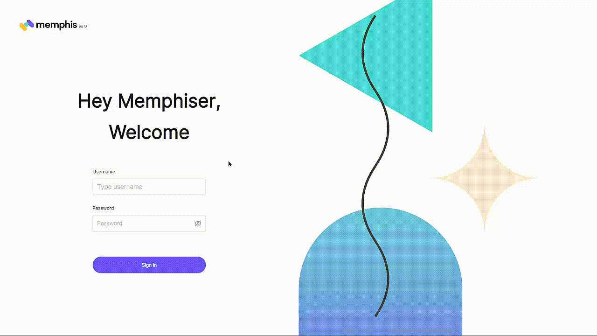

# Real-time chat app

### Introduction

Major systems have all become digital. Usage of applications keeps increasing. Scaling your apps is now implicit.

Usually, your application will consist of multiple services. These services will each be in charge of doing something different. Let's say you're building a chat application. You could have a messages service, a notification service, a status/stories service, a call service, an authentication service, etc.

One or more of these services have to communicate with each other. You want your app to scale properly. You'll choose the best communication method for your platform's services. You need a message broker.

A message broker is an intelligent middleman for your application's services. A message broker receives "messages" from one or more services. It then delivers these "messages" to other services that want to consume them. This way, your platform scales and meets your users' demands.

A message broker is made up of 3 parts. A **queue**, **producers**, and **consumers**. The queue is the manager of messages. The producers send messages to the queue while the consumers receive them.

### About Memphis Broker

Memphis is a modern, powerful, and open-source message broker. Memphis takes away the excess work for data engineers and developers. Memphis broker gives you good developer experience. It reduces your development time by 90%.

Memphis is unique. It comes with a UI and a CLI. You can use the UI to visualize the movements of data. You can use the CLI to run important commands on the broker. There is also the sandbox at [sandbox.memphis.dev](https://sandbox.memphis.dev) for interacting to see what it looks like without installing it.

Memphis is available for Go, Java, NodeJS, and Python. More platforms will be supported soon. In Memphis, a queue is called a station. And many stations can be found in a factory. When you start using Memphis for the first time, you will at least need to create a factory and a station inside that factory.

### How to set up Memphis broker using Docker

[Docker](https://www.docker.com/) is a popular tool for executing and managing software. It provides containers for software execution. It guarantees that a container will have the required dependencies for a given program to run.

You can use Docker to install Memphis. The advantage of using Docker is that you are assured that Memphis will work properly everywhere. Memphis will be the same in your local development and when your app is in production.

To install Memphis, you need to have Docker installed. If you don’t have Docker installed, [install Docker for your Operating System here](https://docs.docker.com/desktop/). Start Docker and ensure it's running.

Run the following command in your terminal to install Memphis. It'll fetch the Docker compose file for Memphis set up and set up Memphis appropriately.

```shell
curl -s https://memphisdev.github.io/memphis-docker/docker-compose.yml -o docker-compose.yml && docker compose -f docker-compose.yml -p memphis up
```

If the command completes successfully, Memphis should be up and running in Docker. If you encounter any issues, consider checking your internet connection.

This is a one-time installation of Memphis. In consequent times, when you need to use Memphis, simply launch Docker Desktop and ensure that the Memphis containers are running.

Carry out the following instructions to complete the Memphis setup in the UI:&#x20;

* Open `localhost:9000` in the browser, it should show you the Memphis UI.&#x20;
* Sign in with `root` and `memphis`. These are the default credentials of the “root” user when you set up Memphis with Docker. Enter chat as the factory name.&#x20;
* Enter `chat` as the station name. Click “Next”.&#x20;
* Enter `chat` as the application user name. Click “Create app user”. It should show you “memphis” as the connection token (password). This is the default.&#x20;
* Skip through the next steps and access the dashboard.

<figure><figcaption></figcaption></figure>

**Note**: You can use different factory, station, and username instead of `chat` above. We are using `chat` to keep things simple. Use names that are meaningful to your project. The Memphis UI permits you to manage factories, stations, and users. You can create more users with varying passwords/token. This ensures security.

### What we will be building

Many applications now need to have a real-time ability. Real-time event-driven architectures use message brokers for many-to-many inter-service communication. Examples of real-time apps include online games, admin dashboards, chat apps, etc.

Let's build a simple chat app. Because it is a simple app, it will have only two services for now. One for all messages and the other for sending messages. The app should have more services but these two are enough to show how to use Memphis.

Let's call this chat app FastChat. In this article, you'll learn how to build FastChat using Memphis broker and NestJS. To keep things simple, FastChat won't save chat messages to any database. It'll keep them in memory while the application is alive. FastChat mainly focuses on showing you how to use Memphis broker.&#x20;

[The final codebase for FastChat is here on GitHub.](https://github.com/obumnwabude/fast-chat/tree/article)

### About NestJS

[NestJS](https://nestjs.com/) is an open-source JavaScript framework for server-side applications. It leverages TypeScript's features to build robust apps. You can structure your Nest project around controllers, modules, and services to properly modularize the code.

FastChat has two services: AllMessages and SendMessage service. These two services will intercommunicate using Memphis broker. We will group them into a Nest module (ChatMessagesModule) because they relate to the same entity.

FastChat also has a BrokerModule. This module will configure Memphis broker. It'll import the MemphisModule and connect the Nest app to Memphis. The BrokerModule will also expose a BrokerService through which other parts of the application can access Memphis.

### How to set up NestJS

To install NestJS, you need to have NodeJS installed. If you don't have NodeJS installed, [download and install it from here.](https://nodejs.org/en/)

To install NestJS, open a new terminal instance and run the following command:

`npm install -g @nestjs/cli`

Now create a new NestJS project. We will use `fast-chat` for the project name. Run the following command:

`nest new fast-chat -p npm`

The `-p` flag is use npm as package manager. Open the newly created `fast-chat` project in your favorite code editor.

### How to set up the ConfigModule in NestJS

Next, we have to set up Memphis broker inside NestJS. But during the setup, we have to connect NestJS to Memphis broker. For such connection, we need at least three properties:

* `host`: The domain name or IP address where Memphis is found, e.g. localhost&#x20;
* `username`: The user that NestJS will act on their behalf, e.g. root&#x20;
* `connectionToken`: The password (token actually) of the above user.

The above three are sensitive information. For security purposes, they shouldn’t be added to source control. Rather, we need to access them through environment variables.

NestJS provides a [ConfigModule](https://docs.nestjs.com/techniques/configuration) for providing environment variables. It uses [dotenv](https://github.com/motdotla/dotenv) internally. Create a file with `.env` as name directly inside the `fast-chat` project folder. Paste the following inside:

`MEMPHIS_HOST=localhost`&#x20;

`MEMPHIS_USERNAME=chat`&#x20;

`MEMPHIS_TOKEN=memphis`

These are the default credentials. You should use more secure credentials in production. That is the very reason of use the ConfigModule in the first place.

Add the NestJS’ ConfigModule to the `fast-chat` project. Run the following command to install it.

`npm install --save @nestjs/config`

Import the ConfigModule in AppModule. NestJS auto-created the `src/app.module.ts` file among other files when we created the project. This file contains the declaration of AppModule. Replace the contents of AppModule with the following:

```
import { Module } from '@nestjs/common';
import { ConfigModule } from '@nestjs/config';
import { AppController } from './app.controller';
import { AppService } from './app.service';

@Module({
  imports: [ConfigModule.forRoot({ isGlobal: true })],
  controllers: [AppController],
  providers: [AppService],
})
export class AppModule {}Here, we are importing the ConfigModule and setting the isGlobal to true. Doing this will auto-import the ConfigModule in all other modules we wil create (which is what we want). In consequent files that need any values from the .env file, you will only access them from ConfigService (coming later on).
```

How to setup Memphis broker in NestJS Run the following command to install Memphis in FastChat:

```javascript
npm install --save memphis-dev
```

Generate the BrokerModule (to set up Memphis) with the following command:

```javascript
nest generate module broker
```

This will create a new broker.module.ts file inside a new broker folder. Delete the contents of this new broker.module.ts file and paste the following:

```javascript
import { Module } from '@nestjs/common'; 
import { MemphisModule } from 'memphis-dev/nest';
@Module({ imports: [MemphisModule.register()], exports: [BrokerService], }) 
export class BrokerModule {}
```

The above imports and registers the MemphisModule. It also exports a BrokerService (which we will create right away. This BrokerService connects the app to Memphis (when NestJS starts up). This BrokerService is what other parts of the Nest app will use to interact with Memphis.

Run the following command to create the `BrokerService`:

```
nest generate service broker
```

This will create a new broker.service.ts file inside the broker folder. Delete its contents and paste the following:

```javascript
import { Injectable, OnModuleInit } from '@nestjs/common';
import { ConfigService } from '@nestjs/config';
import { MemphisService } from 'memphis-dev/nest';

@Injectable()
export class BrokerService implements OnModuleInit {
  consumer;
  producer;

  constructor(
    private configService: ConfigService,
    private memphisService: MemphisService,
  ) {}

  async onModuleInit(): Promise<void> {
    try {
      await this.memphisService.connect({
        host: this.configService.get<string>('MEMPHIS_HOST'),
        username: this.configService.get<string>('MEMPHIS_USERNAME'),
        connectionToken: this.configService.get<string>('MEMPHIS_TOKEN'),
      });
      this.consumer = await this.memphisService.consumer({
        stationName: 'chat',
        consumerName: 'chatConsumer',
        consumerGroup: 'chatConsumers',
      });
      this.producer = await this.memphisService.producer({
        stationName: 'chat',
        producerName: 'chatProducer',
      });
    } catch (error) {
      console.error(error);
      this.memphisService.close();
    }
  }
}
```

The BrokerService imports the ConfigService and the MemphisService. NestJS injects these services using its automatic dependency injection.

The BrokerService implements the OnModuleInit lifecycle method. This is the right place to connect Memphis broker. It is the right place because NestJS calls this method when initialising dependencies. Notice that it connects to Memphis using environment variables from the ConfigService.

The BrokerService also exposes references to the producer and consumer entities of Memphis broker. Other services will use these references to produce or consume "messages" (or events).

Note: Use meaningful consumer and producer names. Use meaningful names that can distinguish in which project a particular producer is producing from or from which is a consumer consuming.

Now we've successfully set up Memphis broker. We now need to create the ChatMessages services and link them with Memphis.

But Before we head over to creating services let's review another useful tool. Servers usually expose REST APIs that clients will call. However, there are alternative methods for server-to-client communication. One of such methods is gRPC.

About gRPC RPC means Remote Procedure Call. It means calling a function that is located remotely (in the server).

gRPC is an open-source RPC framework for client-server communication. gRPC exposes server functions or microservices to clients. The clients too use gRPC to access data from the server(s). gRPC is available for all programming languages.

gRPC is faster than REST APIs. It is faster because it uses Protocol Buffers to exchange data (rather than JSON or XML). Protocol Buffers (ProtoBuf) is a neutral way of expressing structured data. ProtoBuf is easy to understand.

FastChat uses gRPC because gRPC is the go-to way for client-server communication in a Service Oriented Architecture (SOA).

How to set up gRPC in NestJS To set up gRPC, run the following command while inside the fast-chat directory:

npm i --save @grpc/grpc-js @grpc/proto-loader @nestjs/microservices

It adds necessary dependencies for using gRPC in NestJS. Next, create the protobuf (.proto) file for the services in FastChat.

Create a new folder in the src folder, name this new folder chat-message. Create a new file inside this new folder. Name the new file chat-message.proto. Paste the following into this src/chat-message/chat-message.proto

syntax = "proto3";

package ChatMessage;

message Empty { }

message ChatMessage { string author = 1; string text = 2; int64 time = 3; }

service SendMessageService { rpc send (ChatMessage) returns (Empty) {} }

service AllMessagesService { rpc all (Empty) returns (stream ChatMessage) {} }

This is what protobuf looks like. It is language agnostic. The first line is mandatory and it tells the version of protobuf in use. In this case, "proto3", (the latest version).

message in protobuf refers to a custom type we create. ChatMessage contains an author (a string), the message’s text (string) and when the time the message was sent. int64 is a safe way of representing time as a timestamp.

This protobuf file is not a TypeScript file. By default, NestJS includes all TypeScript files when building the server. If a given NestJS project needs to monitor or include non-TypeScript files into the building process, Nest has to be aware of those files.

The src/chat-message/chat-message.proto above file is an example. To tell Nest about it, add it to the nest-cli.json file. This file is directly inside the fast-chat project folder. Include the following into the JSON file:

"compilerOptions": { "assets": \["\*\*/\*.proto"], "watchAssets": true }

One more config step for gRPC involves adding gRPC as a microservice into NestJS. Delete the contents of src/main.ts file and paste the following:

import { NestFactory } from '@nestjs/core'; import { MicroserviceOptions, Transport } from '@nestjs/microservices'; import { join } from 'path'; import { AppModule } from './app.module';

async function bootstrap() { const app = await NestFactory.create(AppModule); app.connectMicroservice({ transport: Transport.GRPC, options: { package: 'ChatMessage', protoPath: join(\_\_dirname, 'chat-message/chat-message.proto'), }, }); await app.startAllMicroservices(); await app.listen(3000); console.log(`Application is running on: ${await app.getUrl()}`); } bootstrap();

How to create a service with NestJS Now that gRPC is properly set up, let's implement our AllMessages and SendMessage services. These services will interact with the ChatMessage type or interface. We need an equivalent of these type in TypeScript (separate from what we declared in protobuf).

Create a new chat-message.interface.ts file inside the chat-message folder. Paste the following inside.

export interface ChatMessage { author: string; text: string; time: number; }

Next, create a ChatMessagesModule that will contain the AllMessages and SendMessage services. Run the following command to create the module.

nest generate module chat-message

This will create a new `chat-message.module.ts` file inside the `chat-message` folder. Given that we will use Memphis broker in the services, import the BrokerModule into this newly generated ChatMessageModule. Delete the contents of the `chat-message.module.ts` file and paste the following:

```
import { Module } from '@nestjs/common';
import { BrokerModule } from 'src/broker/broker.module';

@Module({
  imports: [BrokerModule]
})
export class ChatMessageModule {}
```

gRPC requires that NestJS code implments the methods and services defined in the protobuf file. To implement these services, we will use a controller. A controller in NestJS holds logic for API endpoints. But given that FastChat uses gRPC, the controller will rather hold gRPC functions and services.

Create a new ChatMessageController. Run the following command:

```
nest generate controller chat-message
```

It will create a new `chat-message.controller.ts` file inside the `chat-message` folder. Replace the contents of this file with the following:

```
import { Controller } from '@nestjs/common';
import { GrpcMethod } from '@nestjs/microservices';
import { Observable, ReplaySubject } from 'rxjs';
import { BrokerService } from 'src/broker/broker.service';
import { ChatMessage } from './chat-message.interface';

@Controller('chat-message')
export class ChatMessageController {
  private readonly chatMessages$ = new ReplaySubject<ChatMessage>();

  constructor(private brokerService: BrokerService) {}

  onModuleInit(): void {
    this.brokerService.consumer.on('message', (message) => {
      this.chatMessages$.next(
        JSON.parse(message.getData().toString()) as ChatMessage
      );
      message.ack();
    });
  }

  @GrpcMethod('AllMessagesService', 'all')
  all(): Observable<ChatMessage> {
    return this.chatMessages$.asObservable();
  }

  @GrpcMethod('SendMessageService', 'send')
  async send(chatMessage: ChatMessage): Promise<void> {
    await this.brokerService.producer.produce({
      message: Buffer.from(JSON.stringify(chatMessage))
    });
  }
}
```

ChatMessageController declares a `chatMessages$` [ReplaySubject](https://rxjs.dev/api/index/class/ReplaySubject). This is an entity that we can push values to and listen to values from.

ChatMessageController obtains the BrokerService via dependency injection. In the OnModuleInit lifecycle hook, we consume “messages” from the BrokerService’s consumer, and emit them to `chatMessages$` ReplaySubject. `message.ack();` tells Memphis that the “message” is acknowledged (so that it won’t send that “message” again).

ChatMessageController also implements the two communicating services of this real-time app. SendMessageService takes a ChatMessage and produces it to the BrokerService. In turn, AllMessagesService provides as `chatMessages$` ReplaySubject as an Observable.

Production and Consumption of broker messages can only be done with strings. This is why we convert ChatMessages to and fro strings when sending and receiving them from the BrokerService’s producer and consumer.

At this point, we’ve successfully setup a simple real-time app with NestJS and Memphis broker.

### \[Optional]: Test the Real-time chat app with gRPC client&#x20;

With the way gRPC works, you technically don't make REST API requests. You have to access your backend services from another gRPC SDK (client or server).

We can test the above chat services. One way is to create another gRPC client inside the NestJS project folder. This client will make calls to the services. In turn, you can observe their action in the Memphis Broker UI.

Update the AppModule to import the gRPC ClientsModule. Replace the contents of `src/app.module.ts` with the following:

```
import { Module } from '@nestjs/common';
import { ConfigModule } from '@nestjs/config';
import { ClientsModule, Transport } from '@nestjs/microservices';
import { join } from 'path';
import { AppController } from './app.controller';
import { AppService } from './app.service';
import { BrokerModule } from './broker/broker.module';
import { ChatMessageModule } from './chat-message/chat-message.module';

@Module({
  imports: [
    ConfigModule.forRoot({ isGlobal: true }),
    BrokerModule,
    ChatMessageModule,
    ClientsModule.register([
      {
        name: 'CHAT_MESSAGE',
        transport: Transport.GRPC,
        options: {
          package: 'ChatMessage',
          protoPath: join(__dirname, 'chat-message/chat-message.proto')
        }
      }
    ]),
  ],
  controllers: [AppController],
  providers: [AppService]
})
export class AppModule {}
```

Generate a new ClientController that will call the gRPC methods. Run the following command in the terminal:

```
nest generate controller client
```

This will create a new `client.controller.ts` inside a new `client` folder. Replace the contents of this new file with the following:

```
  import {
  Body,
  Controller,
  Inject,
  OnModuleInit,
  Post,
  Res
} from '@nestjs/common';
import { ClientGrpc } from '@nestjs/microservices';
import { Response } from 'express';
import { firstValueFrom, Observable } from 'rxjs';
import { ChatMessage } from '../chat-message/chat-message.interface';

interface AllMessagesService {
  all(): Observable<ChatMessage>;
}

interface SendMessageService {
  send(chatMessage: ChatMessage): Observable<void>;
}

@Controller('client')
export class ClientController implements OnModuleInit {
  private allMessagesService: AllMessagesService;
  private sendMessageService: SendMessageService;

  constructor(@Inject('CHAT_MESSAGE') private readonly client: ClientGrpc) {}

  onModuleInit(): void {
    this.allMessagesService =
      this.client.getService<AllMessagesService>('AllMessagesService');
    this.sendMessageService =
      this.client.getService<SendMessageService>('SendMessageService');

    this.allMessagesService.all().subscribe((chatMessage: ChatMessage) => {
      console.log(chatMessage);
    });
  }

  @Post('')
  async sendMessage(
    @Body() chatMessage: ChatMessage,
    @Res() res: Response
  ): Promise<void> {
    await firstValueFrom(this.sendMessageService.send(chatMessage));
    res.json({ status: true, message: 'Acknowledged' });
  }
}
```

This ClientController subscribes to the `all` method of the AllMessagesService and prints every ChatMessage to the console. It also exposes a `/client` POST endpoint to receive messages and send them to Memphis broker (through the `send` method of SendMessageService).

Run `nest start` to start the NestJS application.

Use any API tester (cURL, Postman, ThunderClient extension on VS Code, etc.) to send a post request to `localhost:3000/client`. The body of the post request should reflect a valid ChatMessage like:

```
{
  "author": "UserA",
  "text": "Test Chat Message",
  "time": 1661096069756
}
```

You should receive an acknowledgement feedback. Check the Memphis UI at `localhost:9000`, you should notice the sent message (event). Check the NestJS logs and notice that it printed your ChatMessage. Send more POST requests and notice the more messages and logs.

[The final codebase for FastChat is here on GitHub.](https://github.com/obumnwabude/fast-chat/tree/article)

### Why did we use Memphis broker?&#x20;

In a message broker (like Memphis), messages are like events. They are what services use to communicate.

FastChat above is a simple usecase of a message broker. You might not see the essence of producing and consuming messages if this is the only thing you want to build. Besides we placed the two services in the same `.proto` file. We also implemented both services with the same controller. These were because of simplicity.

In a big project, you will separate your services. They might be in different NestJS projects and deployed from different servers. Yet, they will be communicating via Memphis broker. If you were building a chat infrastructure, other services like notifications, authentication, security, etc. are reasons why you should use Memphis broker.

You will use a Memphis broker because it ensures many-to-many (N:N) communication across your application’s services. It also ensures that every service receives the events or “messages”.

### Summary&#x20;

Memphis broker stands out in its speed and ease-of-use among other message brokers. You can install it with Docker. It has a UI and CLI through which you can manage your projects. You can also manage factories, stations, and users with Memphis broker.

The above FastChat is a simple real-time app to get you started with Memphis broker in NestJS. In summary, to build a real-time app with NestJS and Memphis broker:&#x20;

* Connect to Memphis broker using the MemphisService and the connection parameters.&#x20;
* Then produce and consume messages as you need in your application.

Happy Coding!
