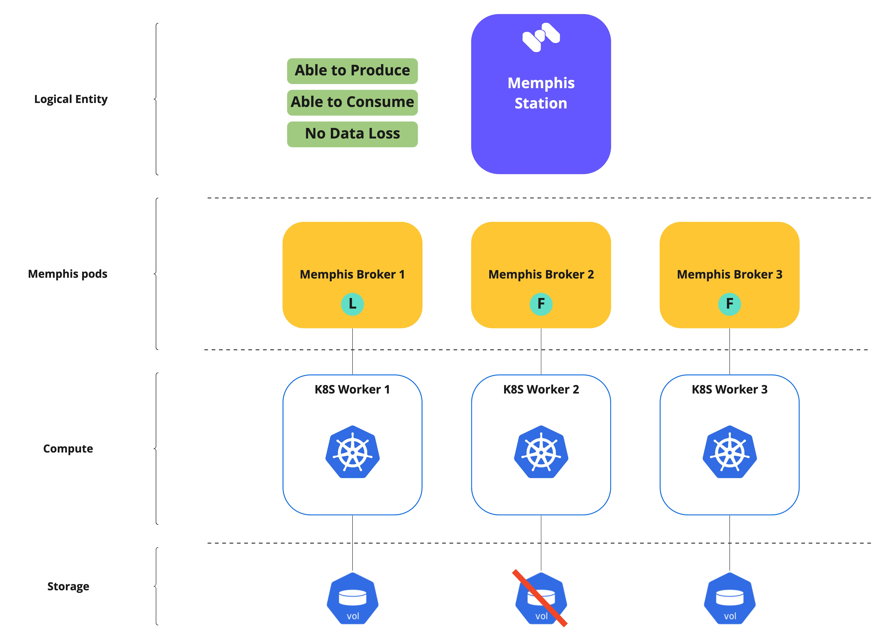
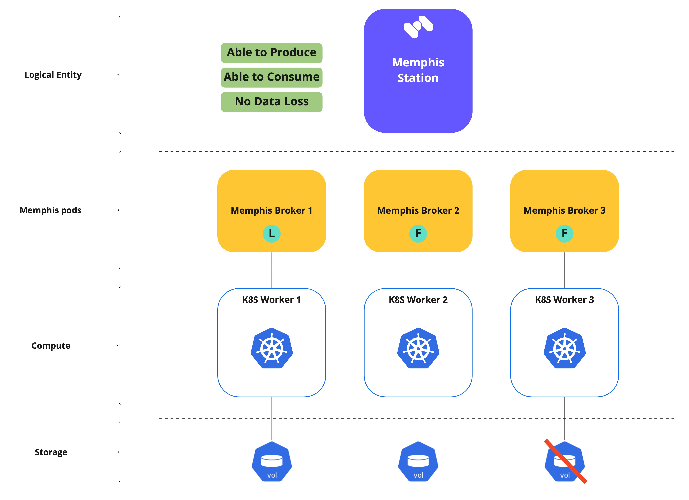
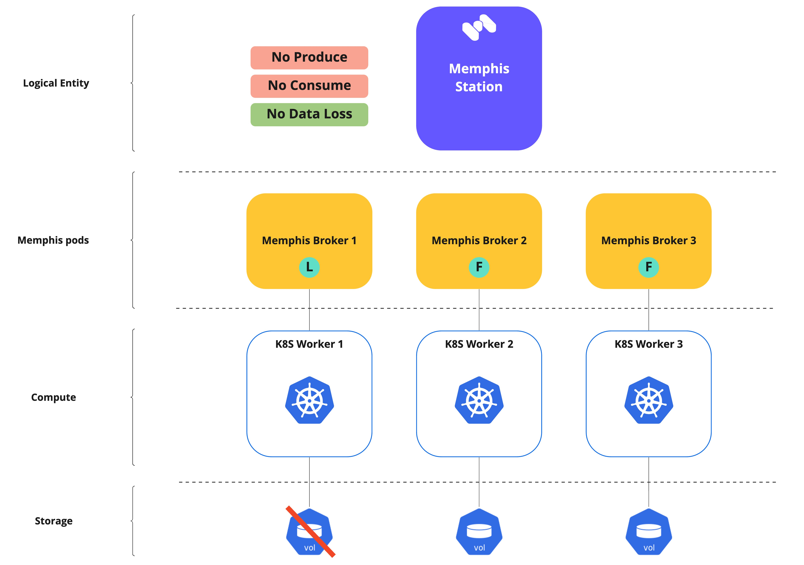
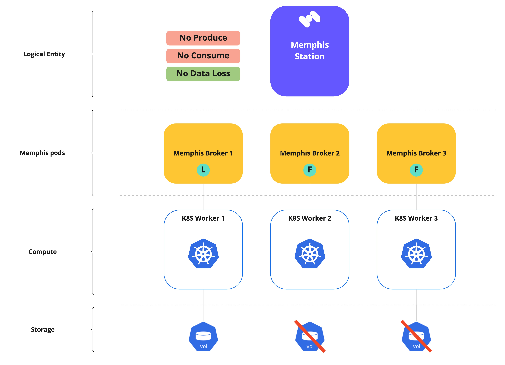
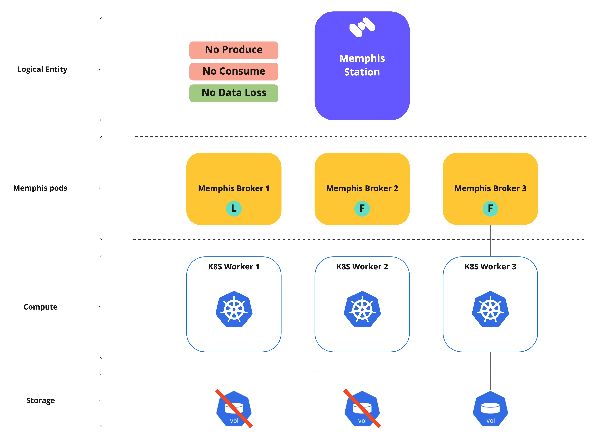

# Failover Scenarios

## Introduction

This section describes the exact behavior of Memphis in different failure scenarios based on three parameters:&#x20;

* Ability to read
* Ability to write
* Potential data loss

This section also aims to educate and explain Memphis's cluster mode's internals so its users can make design decisions that suit their workloads perfectly.

## Initial state

The test environment is based on a station with **three replicas** (mirrors) over **three memphis brokers** in cluster mode.

(\*) The small circle within the brokers emphasizes if they are a ["Leader" or "Follower."](station.md#leaders-and-followers)

<figure><figcaption></figcaption></figure>

## Scenarios

### 1. Memphis brokers

Single broker failure, leader or follower. Produce / Consume is working usually. No data loss.

<figure><figcaption>
Broker 2 is down
</figcaption></figure>

 

<figure><figcaption>
Broker 3 is down
</figcaption></figure>

 

<figure><figcaption>
Broker (Leader) 1 is down
</figcaption></figure>

Two out of three replicas/brokers are down. \
Produce/Consume will be stopped until at least one replica/follower is available. No data loss.

<figure><figcaption></figcaption></figure>

 

<figure><figcaption></figcaption></figure>

The entire cluster is down.&#x20;

Produce/Consume will be stopped until at least one leader and replica/follower are available. No data loss.

<figure><figcaption></figcaption></figure>

### 2. Kubernetes Workers

The kubernetes worker that holds one of the "followers" is down.\
The cluster will wait for the broker to be "Ready."\
Produce / Consume is working usually. No data loss.

<figure><figcaption></figcaption></figure>

 

<figure><figcaption></figcaption></figure>

The kubernetes worker that holds the "leader" is down.\
The "leader" role has been taken over by broker 2.\
Producers / Consumers will might require a reconnect. No data loss.

<figure><figcaption></figcaption></figure>

The kubernetes workers that hold the "followers"/"Leader and a follower" are down.\
No quorum for stream. No cluster leader. The station is temporarily unavailable.\
Produce/Consume will be stopped until at least one replica/follower is available. No data loss.

<figure><figcaption></figcaption></figure>

 

<figure><figcaption></figcaption></figure>

The Kubernetes cluster is down; therefore, the Memphis cluster is down.

Produce/Consume will be stopped until at least one leader and replica/follower are available. No data loss.

<figure><figcaption></figcaption></figure>

### 3. Kubernetes volumes (PVC)

One of the K8S worker's PVs owned by one of the followers is down.

The affected broker and PV require a manual restart.

<figure><figcaption></figcaption></figure>

 

<figure><figcaption></figcaption></figure>

The leader's volume is down.\
Data may not be available during the new leader election process.\
Producing messages is suspended until a new leader is elected.\
The affected broker and PV require a manual restart.

<figure><figcaption></figcaption></figure>

Both followers' volumes are down.\
No quorum for stream. No cluster leader. The station is temporarily unavailable. \
Produce/Consume will be stopped until at least one replica/follower is available. No data loss.

<figure><figcaption></figcaption></figure>

Both leader and follower volumes are down.\
No quorum for stream. No cluster leader. The station is temporarily unavailable. \
Produce/Consume will be stopped until at least one replica/follower is available. No data loss.

<figure><figcaption></figcaption></figure>

All volumes are down; therefore, the Memphis cluster is down.

Produce/Consume will be stopped until at least one leader and replica/follower are available. No data loss.

<figure><figcaption></figcaption></figure>
