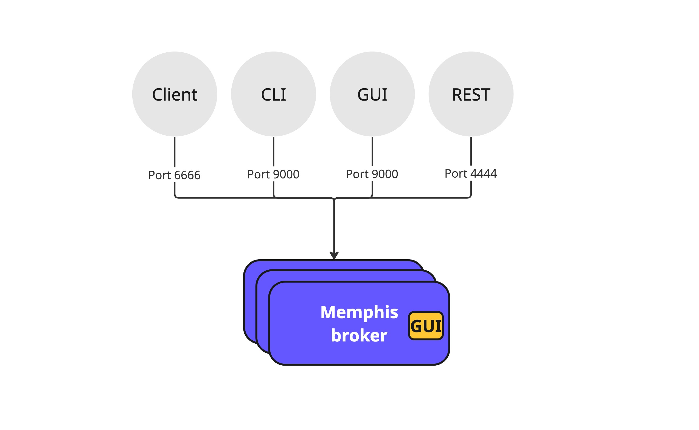
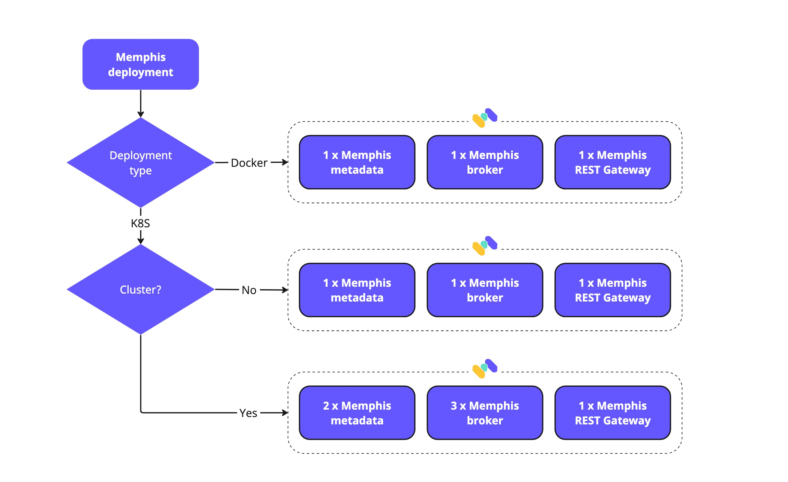

# Architecture

## Key components

Memphis platform comprised three main components:

1. Memphis.\
   The broker itself which acts as the data storage layer. That is the component that stores and controls the ingested messages and their entire lifecycle management.
2. Metadata store.\
   Responsible for storing the platform metadata only, such as general information, monitoring, GUI state, and pointers to dead-letter messages. The metadata store uses Postgres.
3. REST Gateway.\
   Responsible for exposing Memphis management and data ingestion through REST requests.

<figure><figcaption></figcaption></figure>

## Connectivity Diagram

<figure><figcaption></figcaption></figure>

### Ports list

| Name                 | Port | TCP/UDP | Inter/External    | Description                                                    |
| -------------------- | ---- | ------- | ----------------- | -------------------------------------------------------------- |
| Dashboard/CLI        | 9000 | TCP     | External          | External port that serve CLI clients and Web UI dashboard      |
| Client connections   | 6666 | TCP     | Internal/External | Port for TCP-based client connections with memphis SDKs        |
| REST Gateway         | 4444 | TCP     | External          | REST gateway endpoint                                          |
| Websocket            | 7770 | TCP     | External          | Websocket port                                                 |
| Metrics              | 8222 | TCP     | Internal          | Memphis monitor port                                           |
| Cluster connectivity | 6222 | TCP     | Internal          | Internal port for connectiovity between brokers in the cluster |
| Exporter             | 7777 | TCP     | Internal          | Memphis metrics exporter port for Prometheus                   |
| Meta-data            | 5432 | TCP     | Internal          | Meta-data storage port                                         |

### Network architecture diagram

<figure><figcaption></figcaption></figure>

## Ordering

Currently, ordering is guaranteed only while working with a single consumer group.

## Mirroring

Memphis is designed to run as a distributed cluster for a highly available and scalable system. The consensus algorithm responsible for atomicity within Memphis, called RAFT, and compared to Apache ZooKeeper, widely used by other projects like Kafka, does not require a witness or a standalone Quorum. RAFT is also equivalent to Paxos in fault tolerance and performance.

Memphis brokers should run on different nodes to ensure data consistency and zero loss within complete broker’s reboots.&#x20;

To comply with RAFT requirements which are ½ cluster size + 1 an odd number of Memphis brokers shall be deployed. The minimum number of brokers is one, and the next scale would be 3, 5, and so forth.

## Supported Protocols

* [TCP-based SDKs](broken-reference)
* [HTTP](https://github.com/memphisdev/memphis-http-proxy)
* [WebSockets](https://github.com/orgs/memphisdev/projects/2/views/1?pane=issue\&itemId=14008452) \* Soon \*
* gRPC \* Soon \*
* MQTT \* Soon \*
* AMQP \* Soon \*

## Deployment sequence

<figure><figcaption></figcaption></figure>

## Requirements



**Minimum Requirements (Without high availability)**

<table><thead><tr><th>Resource</th><th>Quantity</th><th data-hidden></th></tr></thead><tbody><tr><td>K8S Nodes</td><td>1</td><td></td></tr><tr><td>CPU</td><td>2 CPU</td><td></td></tr><tr><td>Memory</td><td>4GB RAM</td><td></td></tr><tr><td>Storage</td><td>12GB PVC</td><td></td></tr></tbody></table>

****

**Recommended Requirements for production (With high availability)**

| Resource  | Minimum Quantity  |
| --------- | ----------------- |
| K8S Nodes | 3                 |
| CPU       | 4 CPU             |
| Memory    | 8GB RAM           |
| Storage   | 12GB PVC Per node |



**Requirements (No HA)**

| Resource | Quantity               |
| -------- | ---------------------- |
| OS       | Mac / Windows / Linux  |
| CPU      | 1 CPU                  |
| Memory   | 4GB                    |
| Storage  | 6GB                    |



## Delivery Guarantee

* At least once

This is achieved by the combination of published messages being persisted to the station as well as the consumer tracking delivery and acknowledgment of each message as clients receive and process them.

* [Exactly once (Idempotence)](concepts/idempotency.md)

Searched terms: connectivity, cluster, ordering, mirror, mirroring, deployment, protocols, requirements, delivery guarantee
