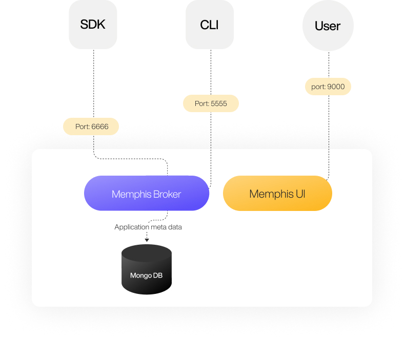

# Architecture

### Connectivity Diagram

Memphis deployment comprised four components:

**1.** UI - The dashboard of Memphis.

**2.** Broker - Messaging Queue. Memphis broker is a fork of [NATS.io](http://nats.io/), which is an existing and battle-tested messaging queue with Memphis improvements and tunings.

**3.** DB - Application state persistency (not used for storing messages).

<figure><figcaption></figcaption></figure>

Consumers are pull-based. The pull interval and the batch size can be configured. Each consumer will get all the messages residing inside a Station. In case an app requires a horizontal scale and split messages across different scaling group members, the user is required to create consumers with the same consumer group.

### Ordering

Ordering is guaranteed only while working with a single consumer.

### Protection

Memphis is designed to run as a distributed cluster for a highly available and scalable system. The consensus algorithm responsible for atomicity within Memphis, called RAFT, and compared to Apache ZooKeeper widely used by other projects like Kafka, does not require a witness or a standalone Quorum. RAFT is also equivalent to Paxos in fault tolerance and performance.

In order to ensure data consistency and zero loss within complete broker’s restarts, Memphis brokers should run on different nodes and try to do it automatically. To comply with RAFT requirements which are ½ cluster size + 1, On K8S environment, three Memphis brokers will be deployed. The minimum number of brokers is three to ensure at least one node failure.

### Protocol

Memphis forked and modified [NATS](https://nats.io) as its core queue.

The NATS streaming protocol sits atop the core NATS protocol and uses [Google's Protocol Buffers](https://developers.google.com/protocol-buffers/). Protocol buffer messages are marshaled into bytes and published as Memphis messages on the specific station.

### Requirements



**Minimum Requirements (No HA)**

| Resource  | Quantity |   |
| --------- | -------- | - |
| K8S Nodes | 1        |   |
| CPU       | 2 CPU    |   |
| Memory    | 4GB RAM  |   |
| Storage   | 12GB PVC |   |

****

**Recommended Requirements (HA)**

| Resource  | Minimum Quantity  |
| --------- | ----------------- |
| K8S Nodes | 3                 |
| CPU       | 4 CPU             |
| Memory    | 8GB RAM           |
| Storage   | 12GB PVC Per node |



**Requirements (No HA)**

| Resource | Quantity               |
| -------- | ---------------------- |
| OS       | Mac / Windows / Linux  |
| CPU      | 1 CPU                  |
| Memory   | 4GB                    |
| Storage  | 6GB                    |



