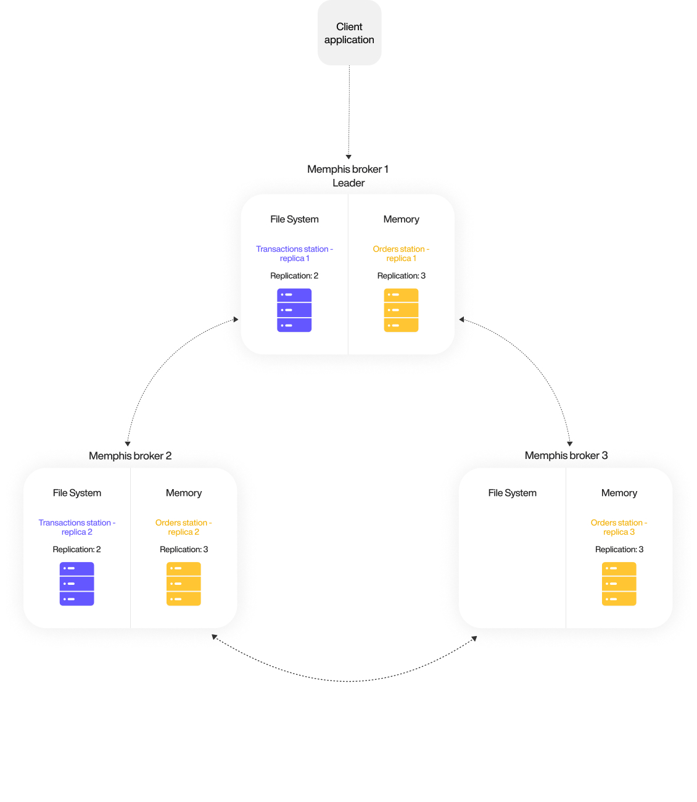

# Architecture

## Connectivity Diagram

Memphis deployment comprised four components:

**1.** GUI - The dashboard of Memphis.

**2.** Broker (or brokers in cluster mode)

**3.** MongoDB - Only for UI state persistency (not used for storing messages). Will be replaced in the coming versions.

<figure><figcaption></figcaption></figure>

### Ports list

| Name                 | Port | TCP/UDP | Inter/External | Description                                                    |
| -------------------- | ---- | ------- | -------------- | -------------------------------------------------------------- |
| Dashboard/CLI        | 9000 | TCP     | External       | External port that serve CLI clients and Web UI dashboard      |
| Client connections   | 6666 | TCP     | External       | Port for TCP-based client connections with memphis SDKs        |
| REST Gateway         | 4444 | TCP     | External       | REST gateway endpoint                                          |
| Websocket            | 7770 | TCP     | External       | Websocket port                                                 |
| Metrics              | 8222 | TCP     | Internal       | Memphis monitor port                                           |
| Cluster connectivity | 4222 | TCP     | Internal       | Internal port for connectiovity between brokers in the cluster |
| Exporter             | 7777 | TCP     | Inter/External | Memphis metrics exporter port for Prometheus                   |

Consumers are pull-based. The pull interval and the batch size can be configured. Each consumer will consume all the messages residing inside a station. The user must create consumers within the same consumer group if a client requires a horizontal scale and split messages across different consistency group members.

MongoDB is not for data traffic or standard broker behavior but rather responsible for UI state and metadata only.

## Memphis cluster component diagram (For production)

Full Kubernetes-based layout.

<figure><figcaption></figcaption></figure>

## Ordering

Ordering is guaranteed only while working with a single consumer group.

## Mirroring

Memphis is designed to run as a distributed cluster for a highly available and scalable system. The consensus algorithm responsible for atomicity within Memphis, called RAFT, and compared to Apache ZooKeeper, widely used by other projects like Kafka, does not require a witness or a standalone Quorum. RAFT is also equivalent to Paxos in fault tolerance and performance.

To ensure data consistency and zero loss within complete broker’s restarts, Memphis brokers should run on different nodes and try to do it automatically. To comply with RAFT requirements which are ½ cluster size + 1, On K8S environment, three Memphis brokers will be deployed. The minimum number of brokers is three to ensure at least one node failure.

## Supported Protocols

* [TCP-based SDKs](broken-reference)
* [HTTP](../sdks-and-protocols/rest-http.md)
* WebSockets \* Soon \*
* gRPC \* Soon \*
* WASM \* Soon \*
* MQTT \* Soon \*

## Deployment sequence

<figure><figcaption></figcaption></figure>

## Requirements



**Minimum Requirements (No HA)**

<table><thead><tr><th>Resource</th><th>Quantity</th><th data-hidden></th></tr></thead><tbody><tr><td>K8S Nodes</td><td>1</td><td></td></tr><tr><td>CPU</td><td>2 CPU</td><td></td></tr><tr><td>Memory</td><td>4GB RAM</td><td></td></tr><tr><td>Storage</td><td>12GB PVC</td><td></td></tr></tbody></table>

****

**Recommended Requirements (HA)**

| Resource  | Minimum Quantity  |
| --------- | ----------------- |
| K8S Nodes | 3                 |
| CPU       | 4 CPU             |
| Memory    | 8GB RAM           |
| Storage   | 12GB PVC Per node |



**Requirements (No HA)**

| Resource | Quantity               |
| -------- | ---------------------- |
| OS       | Mac / Windows / Linux  |
| CPU      | 1 CPU                  |
| Memory   | 4GB                    |
| Storage  | 6GB                    |



## Delivery Guarantee

* At least once

This is achieved by the combination of published messages being persisted to the station as well as the consumer tracking delivery and acknowledgment of each message as clients receive and process them.

* [Exactly once (Idempotence)](concepts/idempotency.md)

Searched terms: connectivity, cluster, ordering, mirror, mirroring, deployment, protocols, requirements, delivery guarantee
