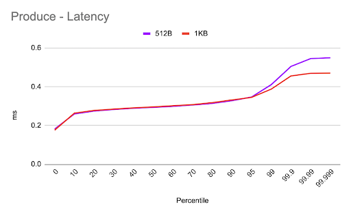

# Benchmark

We're excited to announce the release of our 1st benchmark report.&#x20;

Memphis has been under heavy development for the past two years, and we've reached a state where we can display some actual performance numbers.&#x20;

## Introduction

### Benchmark Version Control

<table><thead><tr><th>Version</th><th>Date</th><th>Memphis Version</th><th>Comments</th><th data-hidden></th></tr></thead><tbody><tr><td>1.0</td><td>November 27th, 2022</td><td>0.4.0-beta</td><td>First release</td><td></td></tr><tr><td></td><td></td><td></td><td></td><td></td></tr><tr><td></td><td></td><td></td><td></td><td></td></tr></tbody></table>

### Lab environment

<table><thead><tr><th>Parameter</th><th>Value</th><th data-hidden></th></tr></thead><tbody><tr><td>Cloud</td><td>AWS</td><td></td></tr><tr><td>Managed Kubernetes</td><td>EKS 1.23</td><td></td></tr><tr><td>K8S Workers</td><td>3</td><td></td></tr><tr><td>K8S Worker type</td><td><a href="https://aws.amazon.com/ec2/instance-types/">i3en.large</a></td><td></td></tr><tr><td>Memphis brokers</td><td>3</td><td></td></tr><tr><td>Memphis version</td><td>0.4.0 Cluster mode</td><td></td></tr><tr><td>Benchmark app node</td><td>m5n.8xlarge</td><td></td></tr></tbody></table>

### Test cases

* Message size -
  * 512B
  * 1KB
  * 256KB
  * 1MB
* Messages rate - 300msgs/sec\*
* Method: Async

(\*) To align and run the same frequency across the different message sizes

### Notes

1. In each iteration, the counter starts with the first sent message, stops at the last one, waits until the end of the second, and repeats.
2. Each test runs 1000 times to produce “normalized” results.

\---------------------------------------------------

## Produce

Demonstrates latency and stability over time for the different message sizes.

As can be seen, the graph starts with 0.2ms, climbs to&#x20;

<figure><figcaption></figcaption></figure>

<figure><figcaption></figcaption></figure>

