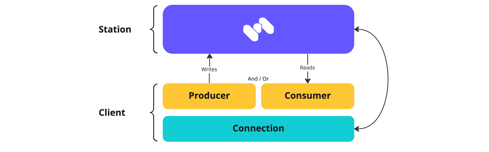

# Consumer API

##

##

## What is a consumer?

A consumer is a client that reads data or messages from the broker or, more specifically, from the station.&#x20;

As the user configures a client connection to Memphis, it comprises several objects:

* Connection - An open socket between the client to Memphis. Only required once as the client/application gets initialized for the first time.
* Consumer - A consumer entity must be declared to read data/messages from Memphis.
* (And/or) Producer - A producer entity must be declared to write data/messages into Memphis.

<figure><figcaption></figcaption></figure>

Memphis consumers are “long-polling” by design and will wait for infinite time till a new message gets ingested into the Memphis station, including out-of-the-box retry connection and polling mechanisms to make sure consumers retry to connect in case of disconnection and repoll unack message.

### Broker Data Format

Memphis started from NATS which receives, stores, and sends data in binary format for performance, format alignment, and efficient memory allocations.

When consumers consume messages to Memphis station, they should be converted from binary to string or any other type needed.

An example from the `node.js` SDK using `.getData().toString()` -

```
consumer.on('message', (message) => {
  let msg = message.getData().toString();
  message.ack();
});
```

<figure><figcaption></figcaption></figure>


**Unexist stations** will be created **automatically** through the SDK on the first producer/consumer connection.


### Parameters

(\*) Names might be a bit different from one SDK to another. Meanings are the same.

**Connection**

* `host`: Memphis URL
* `port`: Memphis port
* `username`: Can be root or any other application-type user
* `password`: Each application-type user comprises both a username and a password
* `connectionToken`: \*Valid only in case connection-token-based authentication was chosen\*\
  The token received when the user created. Will change in the future to more robust credentials and authentication system
* `reconnect`: The connection entity will try to reconnect to Memphis in case of a disconnection
* `maxReconnect`: Amount of time the client will try to reconnect before backing off
* `reconnectIntervalMs`: Time window between one retry to another
* `timeoutMs`: Ability to kill a dead connection after explicit time

**Consumer**

* `the stationName`: The name of the station to be connected.
* `consumerName`: In a station resolution, each connected consumer must have a unique identity.
* `consumerGroup`: Explained in detail [here](broken-reference). Consumers are grouped under an object called "Consumer group." If not specified, a default CG will be created using the _consumerName._
* `pullIntervalMs`: Configured in milliseconds, this parameter defines the intervals of each consume operation. For example, if the value is set to 1000, it means that every 1000 ms, the consumer will try to pull new messages.
* `batchSize`: Defines how many messages will be collected per pull operation.
* `batchMaxTimeToWaitMs`: Defines how much time (in milliseconds) the consumer should wait for the entire required batch to be collected.
* `maxAckTimeMs`: For the consumer to receive the next message, the current one must be acknowledged, meaning the consumer is ready to consume and handle the next message. Oftentimes, the consumer gets crashed/throws an exception / not able to handle the message. The _`maxAckTimeMs`_ ensure that until X millisecond Memphis has not received ACK, it will automatically retransmit the message. If not configured correctly, it can result in duplicate processing.
* `maxMsgDeliveries`: The number of times Memphis will retransmit the same message to the same consumer. Max message deliveries.
* `caFile`: In case [encrypted client-Memphis](../../deployment/kubernetes/) communication is used. '\<rootCA.pem>'.
* `certFile`: In case [encrypted client-Memphis](../../deployment/kubernetes/) communication is used. '\<cert-client.pem>'.
* `keyFile`: In case [encrypted client-Memphis](../../deployment/kubernetes/) communication is used. '\<key-client.pem>'.
* `prefetch = true`: will prefetch the next batch of messages and store it in memory for future Fetch() requests.


For more information about how to create and connect a consumer to Memphis,&#x20;

please head [here](broken-reference)


### Sequence (Offsets)

The offset is a simple integer number that is used by Memphis to maintain the current position of a consumer group. The current offset (like disk offset) is a pointer to the last record that Memphis sent to a consumer group in its most recent poll. So, the consumer group doesn't get the same record twice because of the current offset.

While in most messaging systems, it is the client's responsibility to track the read offsets, in Memphis, the broker and SDK communicate with each other and record the acknowledged offsets automatically for the client. A specific offset can be used to re-read an acknowledged message if needed.

### Prefetching

\*Currently supported in **GO SDK only**\*

Prefetching optimization to improve throughput. \
Before returning a set of records to the user in consume(), the consumer will initiate the next round of fetches in order to pipeline the fetching overhead and message processing. While the consumer is processing the current batch of records, the broker can handle the consumer's fetch requests. The idea is to have data available when the consumer finishes processing, invokes consume() again and gets a batch of messages.

#### Fetch a single batch of messages

```
msgs, err := conn.FetchMessages("<station-name>", "<consumer-name>",
  memphis.FetchBatchSize(<int>) // defaults to 10
  memphis.FetchConsumerGroup("<consumer-group>"), // defaults to consumer name
  memphis.FetchBatchMaxWaitTime(<time.Duration>), // defaults to 5 seconds, has to be at least 1 ms
  memphis.FetchMaxAckTime(<time.Duration>), // defaults to 30 sec
  memphis.FetchMaxMsgDeliveries(<int>), // defaults to 10
  memphis.FetchConsumerGenUniqueSuffix(),
  memphis.FetchConsumerErrorHandler(func(*Consumer, error){})
  memphis.FetchStartConsumeFromSeq(<uint64>)// start consuming from a specific sequence. defaults to 1
  memphis.FetchLastMessages(<int64>)// consume the last N messages, defaults to -1 (all messages in the station))
```

#### Fetch a single batch of messages after consumer creation

`prefetch = true` will prefetch the next batch of messages and store it in memory for future Fetch() requests. Note: Use a higher `MaxAckTime` as the messages will reside in a local cache for some time before being processed.

```
msgs, err := consumer.Fetch(<batch-size> int, <prefetch> bool)
```

## Supported Protocols

* [NATS Protocol (Client SDKs)](broken-reference)
* [HTTP](https://github.com/memphisdev/memphis-http-proxy)
* [WebSockets](https://github.com/orgs/memphisdev/projects/2/views/1?pane=issue\&itemId=14008452) \* Soon \*
* gRPC \* Soon \*
* MQTT \* Soon \*
* Kafka \* Soon \*
* AMQP \* Soon \*

Search terms: max message deliveries, batch, batches
