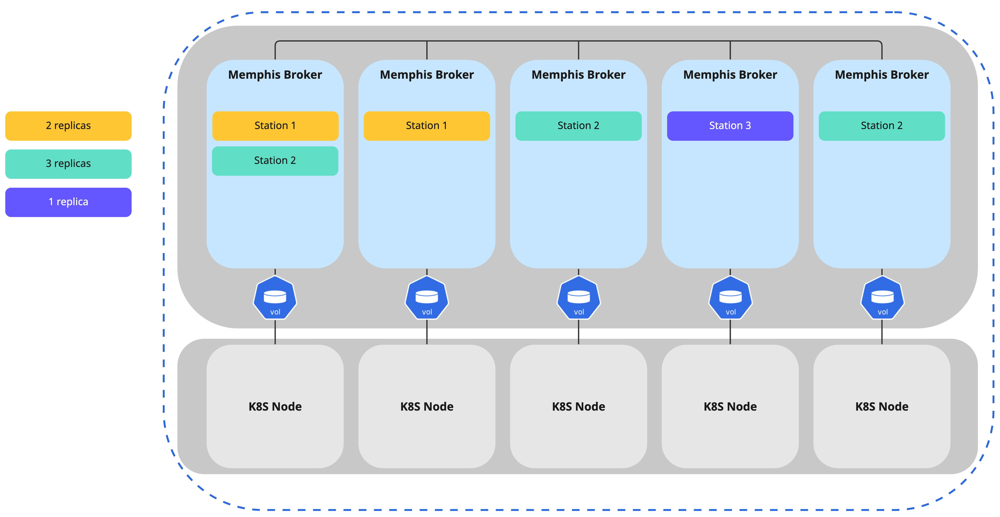
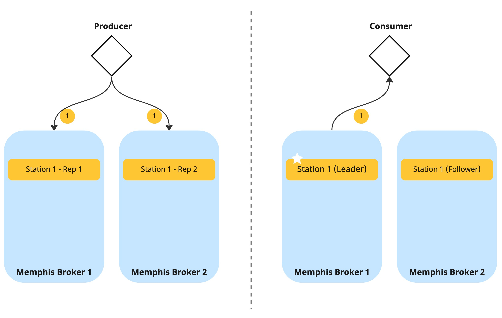
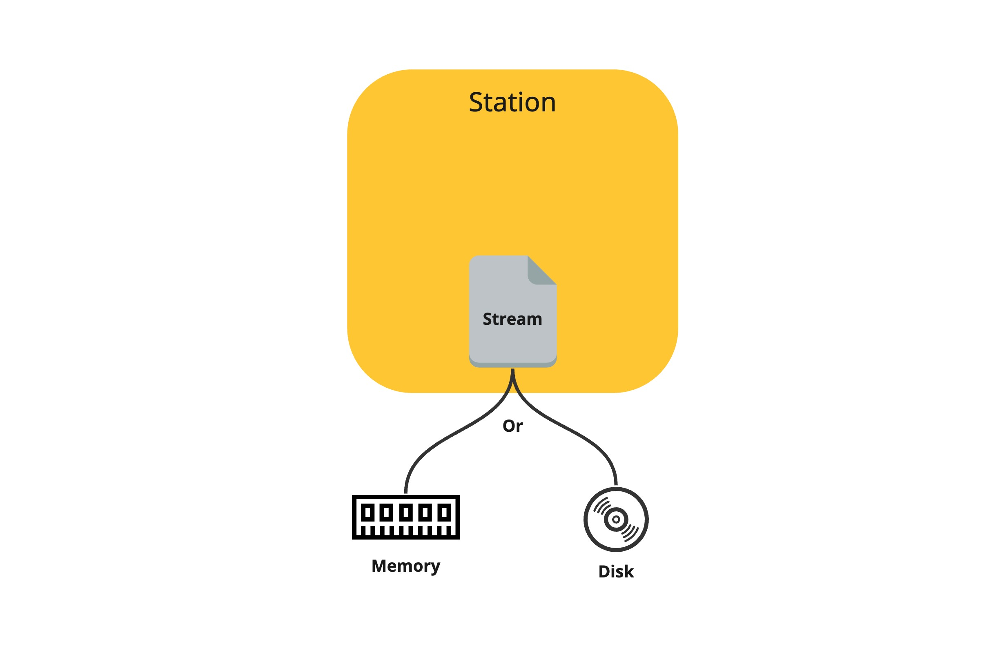
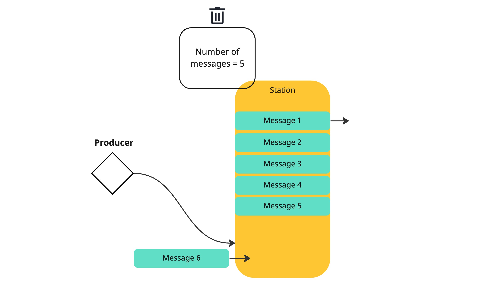
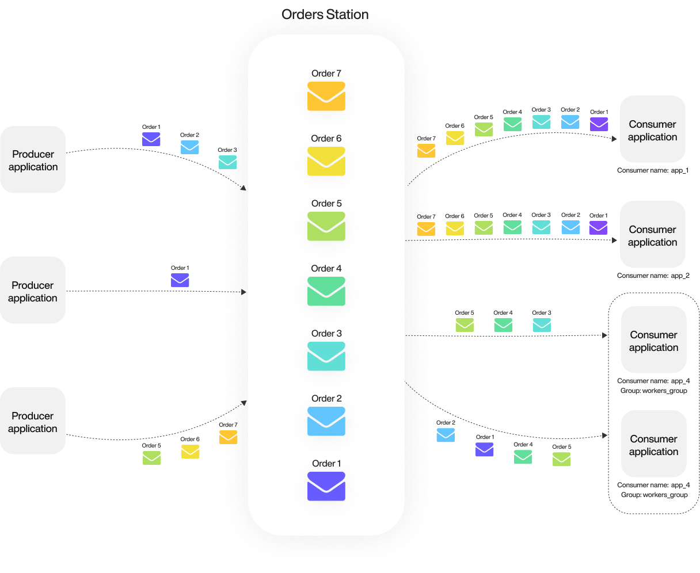

# Station

## What is a station?

A station is a distributed unit that stores messages. Similar to Kafka's topics and RabbitMQ's queues. Each station has a retention policy, which defines when and how messages will be removed from the station—for example, by the number of stored messages, store time, or total size of stored messages.

Each station is distributed across one or more Memphis brokers, depending on the number of configured station replicas. Data will be poured in a RAID-1 manner.

<figure><figcaption>
How replicas work
</figcaption></figure>

<figure><figcaption>
Produce/Consume data
</figcaption></figure>

A station is a virtual entity that resides on a type of file called "stream" which stores the data. Stream files are stored on the broker's memory or non-volatile storage, based on the user's configuration per station.&#x20;

### Leaders and followers

Memphis is based on NATS Jetstream, which makes use of RAFT algorithm as a non-quorum consensus algorithm.

Raft is a consensus algorithm designed as an alternative to the Paxos family of algorithms.\
Raft offers a generic way to distribute a state machine across a cluster of computing systems, ensuring that each node in the cluster agrees upon the same series of state transitions.

Raft is not a Byzantine fault-tolerant algorithm: the nodes trust the elected leader.

Each station stores a stream component with a single leader on the most available broker for consensus reasons. In case of broker failure, the leader role will be transferred to a follower in configured replicas.

Naturally, choosing memory persistency will improve performance, while disk-based persistency will provide higher availability.

<figure><figcaption></figcaption></figure>

### Replicas (Mirroring)

Available in cluster mode only. During station creation, the user can choose the number of station replicas. Replicas are an exact mirror of the entire station data, and each produced message will be mirrored across the configured replicas. Each replica will be stored on a different broker; therefore, the maximum number of replicas is derived from the number of brokers in a cluster.

Replicas can be defined using the SDK, GUI, or CLI.

The number of replicas cannot be changed after station creation. (Will be in the future)

### Retention

In a message broker, messages are not deleted when acknowledged to enable new or other consumers from different consumer groups to consume the stored messages as well.

To avoid filling out the station, we must choose a retention policy per station that defines the condition that will trigger Memphis to remove messages from a station.

* Number of messages.

The station will only retain the last X produced messages.&#x20;

<figure><figcaption></figcaption></figure>

* Station size

High threshold for station capacity in bytes.

* Time

Each produced message receives a dedicated timer and will be removed after hitting the configured time.

### Ordering and delivery

Ordering is guaranteed only while working with a single consumer group.

As seen in the illustration below, each **consumer group** will receive **all** the messages stored within the station.

<figure><figcaption></figcaption></figure>

## Parameters

| Parameter               | Description                                 | Potential values                       |
| ----------------------- | ------------------------------------------- | -------------------------------------- |
| Max message size        | The maximum message size possible to ingest | Up to 64Mb. By default the size is 8Mb |
| Station name max length | The maximum length of a station name        | Up to 128 characters                   |
|                         |                                             |                                        |

Searched terms: max message, max message size, retention, Retention
