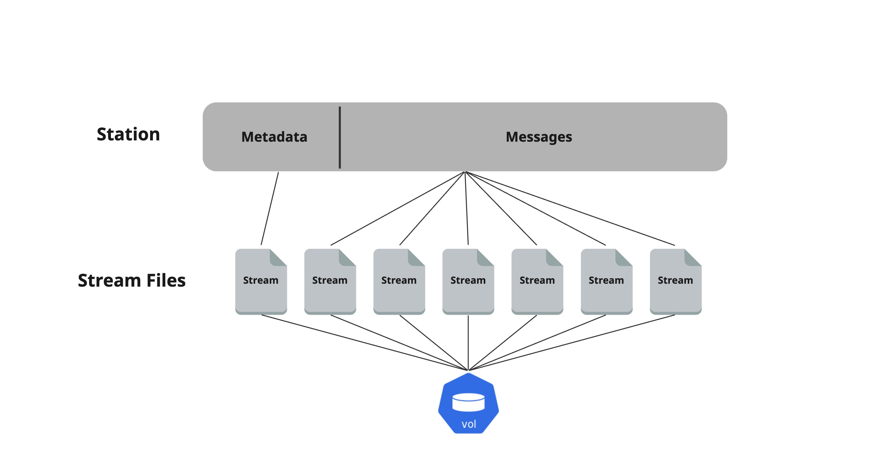

# Storage and Redundancy

## Introduction

Data redundancy in the field of streaming can be a bit misleading. As written on the [station](station.md) page, in message brokers, data is not preserved for an infinite time but for a defined period based on certain conditions like ingested time, size, and the number of messages within a station.

When data resides in the broker, it will be redundant and removed only when crossing the defined retention policy.

### The object behind the station - Stream

Each station implements a stream object that contains the messages stored in the station.\
It is up to the user to define which type of storage will this stream object be saved.

<figure><figcaption></figcaption></figure>

## Replicas (Mirroring)

Available in cluster mode only.

During station creation, the user can choose the number of station replicas. Replicas are an exact mirror of the entire station data, and each produced message will be mirrored across the configured replicas. Each replica will be stored on a different broker; therefore, the maximum number of replicas is derived from the number of brokers in a cluster.\
In case of a broker or disk loss, replicas will be used to rebuild the missing replica to maintain the required amount of replicas and, at the same time, ensure data availability through a different broker.

Replicas can be defined using the SDK, GUI, or CLI.

The number of replicas cannot be changed after station creation (but can be in the future)

## Storage tiering

Memphis offers a range of storage types that you can choose from based on your workload's data access, resiliency, frequency, and cost requirements, and configured per station.

### Tier 1 (Local storage)

The first type of storage each message will initially be stored at.

The options are Memory or Disk. Each with its strengths and weaknesses.

* **Memory**\
  For faster performance.\
  Due to its nature as a volatile type of storage, the risk of losing data in case of failure is higher because it resides in the broker's memory, and in the case of a station without configured replicas, data can be lost.

<figure><figcaption><p>Stream object as it construct and stored</p></figcaption></figure>

<figure><figcaption><p>Ack process</p></figcaption></figure>

* **Disk**\
  For higher availability.\
  Disk storage might be slower than memory, but it offers greater availability and resiliency to broker failures.

<figure><figcaption></figcaption></figure>

<figure><figcaption><p>Ack process</p></figcaption></figure>

### Tier 2 (Remote storage)

The typical pattern of message brokers is to delete messages after passing a defined retention policy, like time/size/number of records.

Memphis offers a second storage tier for longer, possibly infinite retention for stored messages.\
Each message that expels from the station will automatically migrate to the second storage tier.


[Here is how](../../platform-integrations/storage/) to enable Memphis storage tiering


#### Architecture

<figure><figcaption></figcaption></figure>

#### Step-by-step explanation

1. Once supported remote storage is connected, storage tiering will be available for the entire cluster.
2. The activation and enablement of the storage tiering takes place per station.
3. Once storage tiering is enabled for specific stations, out-of-retention records (messages) will be migrated to an internal buffer where every 8 seconds (default), an async task will pack the buffer and migrate it to the second storage tier. \
   \
   The packing interval can change via the "Environment configuration."
4.  At the object storage, a directory within the selected bucket will be created under the name "`memphis`"; within the `memphis` directory, a nested directory will be created for each enabled station.\


    <figure><figcaption></figcaption></figure>
5. Within Each directory, a JSON file will be created with the latest buffer content mentioned in Step 3. The name of the file is a generated hash to avoid duplications. Content example:


```json
[{"payload":"7b2263697479223a224e657720596f726b222c22636f756e747279223a22555341222c22656d61696c223a226a6f686e406578616d706c652e636f6d222c22686f626279223a22436f6f6b696e67222c226f636375706174696f6e223a22536f66747761726520456e67696e656572222c2270686f6e65223a223535352d313234227d","headers":{"$memphis_connectionid":"b2742350-3017-43a5-a34f-adc421a88acc","$memphis_producedby":"ui"}}]
```


Each array item is a message migrated from Memphis station. The payload is encoded in Hex and should be decode into the original format (JSON / Protobuf / Avro).
